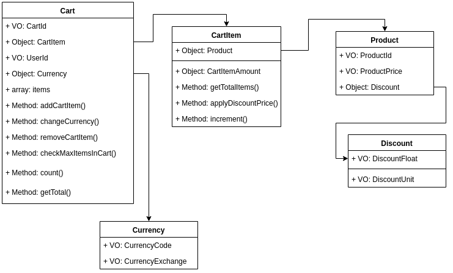

####Modelo de datos



### Estructura de directorios
```scala
src
├── Cart
│   ├── Aplication
│   │   ├── AddCartItem
│   │   │   ├── AddCartItemCommandHandler.php
│   │   │   ├── AddCartItemCommand.php
│   │   │   └── AddCartItem.php
│   │   ├── CurrencyCartTotal
│   │   │   ├── CurrencyCartTotalCommandHandler.php
│   │   │   ├── CurrencyCartTotalCommand.php
│   │   │   └── CurrencyCartTotal.php
│   │   ├── RemoveCartItem
│   │   │   ├── RemoveCartItemCommandHandler.php
│   │   │   ├── RemoveCartItemCommand.php
│   │   │   └── RemoveCartItem.php
│   │   └── TotalCart
│   │       ├── TotalCart.php
│   │       ├── TotalCartQueryHandler.php
│   │       └── TotalCartQuery.php
│   ├── Domain
│   │   ├── CartId.php
│   │   ├── Cart.php
│   │   ├── CartRepository.php
│   │   └── Exceptions
│   │       ├── CartNotExistException.php
│   │       └── ProductDifferentMaxInCartException.php
│   └── Infrastructure
│       └── InMemory
│           └── InMemoryCartRepository.php
├── CartItem
│   └── Domain
│       ├── CartItemAmount.php
│       ├── CartItem.php
│       └── Exceptions
│           └── ProductsMaxAmountException.php
├── Currency
│   ├── Domain
│   │   ├── CurrencyCode.php
│   │   ├── CurrencyExchange.php
│   │   ├── Currency.php
│   │   ├── CurrencyRepository.php
│   │   └── Exceptions
│   │       ├── CurrencyCodeInvalidCodeException.php
│   │       └── InvalidExhangeRateExceptions.php
│   └── Infrastructure
│       └── Request
│           └── ExchangeRatesApiRepository.php
├── Discount
│   └── Domain
│       ├── DiscountFloat.php
│       ├── Discount.php
│       └── DiscountUnit.php
├── Kernel.php
├── Product
│   ├── Application
│   │   ├── Create
│   │   │   ├── CreateProductCommandHandler.php
│   │   │   ├── CreateProductCommand.php
│   │   │   └── CreateProduct.php
│   │   └── Find
│   │       ├── FindProduct.php
│   │       ├── FindProductQueryHandler.php
│   │       └── FindProductQuery.php
│   ├── Domain
│   │   ├── ProductId.php
│   │   ├── Product.php
│   │   ├── ProductPrice.php
│   │   └── ProductRepository.php
│   └── Infrastructure
│       └── InMemory
│           └── InMemoryProductRepository.php
├── Shared
│   └── Domain
│       ├── Bus
│       │   ├── Command
│       │   └── Query
│       ├── Exception
│       │   ├── InvalidNumberArgumentException.php
│       │   ├── NumberNotNegativeOrZero.php
│       │   ├── Product
│       │   ├── UuidNotValidException.php
│       │   └── ValueIsEmptyException.php
│       ├── User
│       │   └── UserId.php
│       └── ValueObject
│           ├── FloatNumber.php
│           ├── IntNumber.php
│           └── Uuid.php
└── UI
    └── Cli
        └── InteractiveCartCommand.php


```
